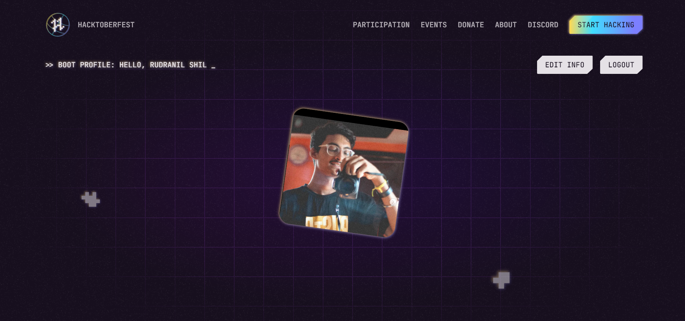
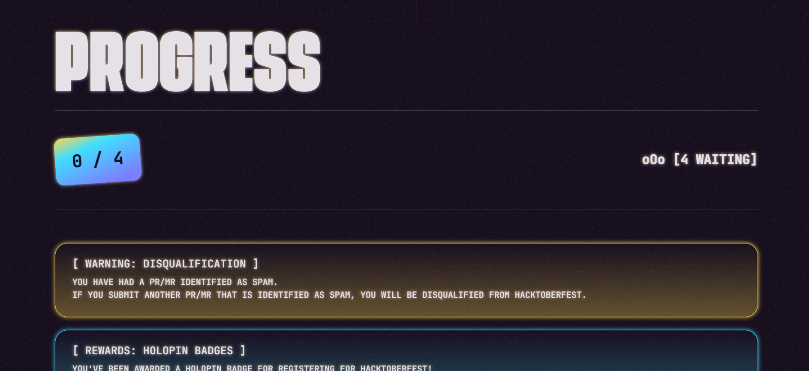
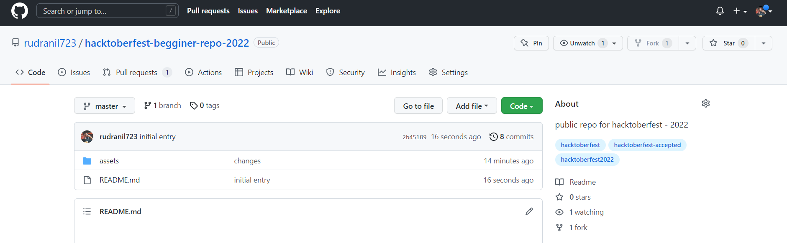
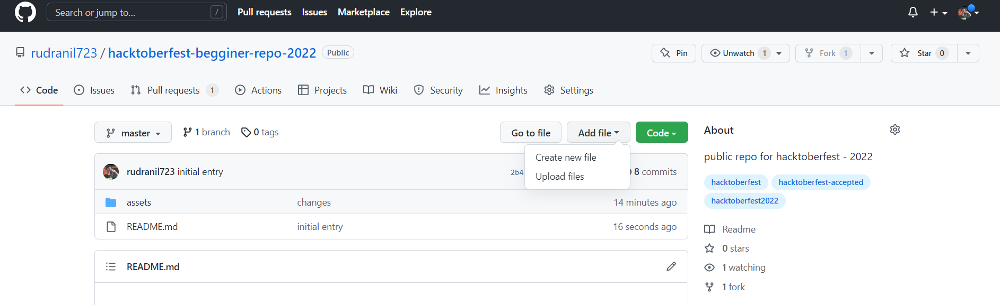
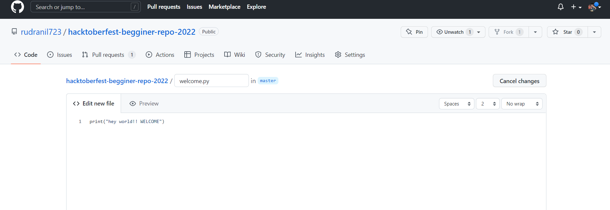
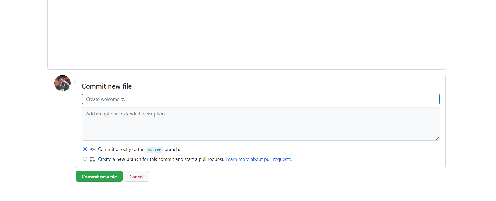
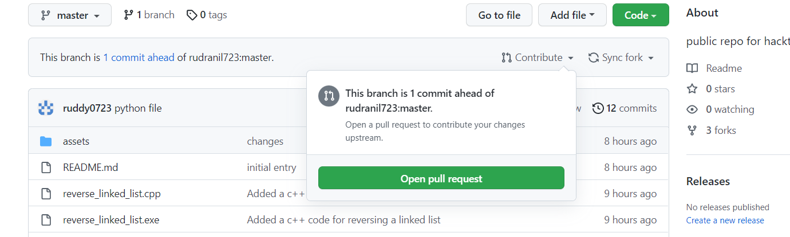
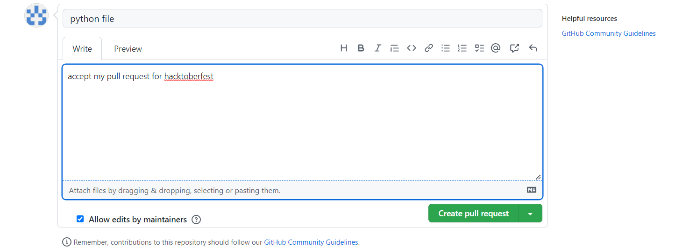
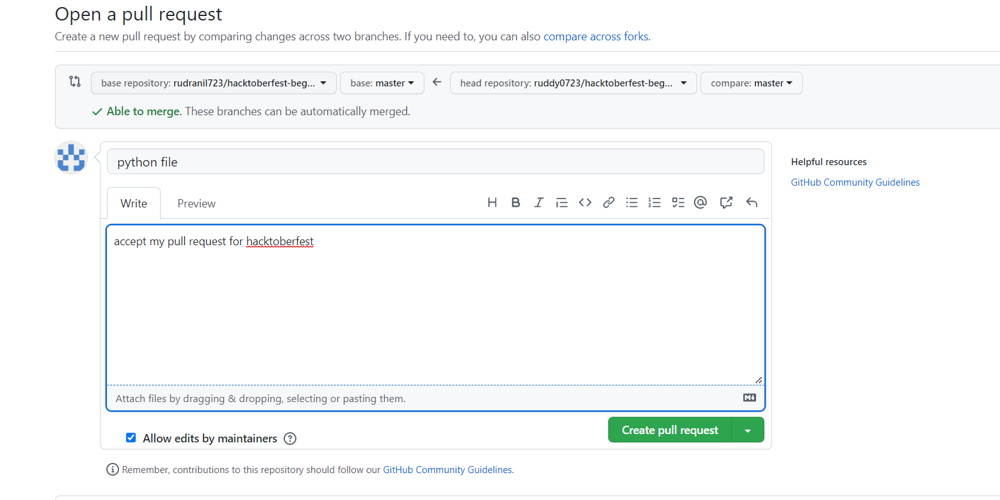

### <h1 align="center">Hacktoberfest-begginer-repo-2022</h1>

<h2 align="center"> Hacktoberfest 2022 </h2>

<h3 align="center">
    <a href="https://hacktoberfest.com/">
        Link To HacktoberFest 2022
    </a>
</h3>

## Event details :

- Hacktoberfest is a **month-long** challenge. It happens every year in the month of October.
- Hacktoberfest is open to everyone and it marks the celebration of Open Source. It's the biggest Open Source event that encourages newbies to participate in Open Source and create their 1st meaningful PR.
- Hacktoberfest will be hosted by Digital Ocean for the 8th year in a row in partnership with GitHub and other companies.
- Hacktoberfest® is **open to everyone** in our global community. Whether you’re a developer, student learning to code, event host, or company of any size, you can help drive growth of open source and make positive contributions to an ever-growing community.
- All backgrounds and skill levels are encouraged to complete the challenge.
- Hacktoberfest is a celebration open to everyone in our global community.
- You can sign up **anytime between October 1 and October 31**.
    

### 
STEPS:-

### 1. Create a GitHub account:

  
Create a GitHub account, if you don't already have one. Need help? Here are some resources to help you set up your GitHub account:

- https://docs.github.com/en/get-started/signing-up-for-github/signing-up-for-a-new-github-account
- https://www.youtube.com/watch?v=QUtk-Uuq9nE
- https://www.youtube.com/playlist?list=PLseEp7p6EwiZgLPknY4ITJxfoo75wqxph
    

##

### 2. Register for Hacktoberfest: Navigate to the [Hacktoberfest registration page](https://hacktoberfest.com/) and follow the instructions. But, read the rules carefully before you do and then sign In using your GitHub credentials.

  

  

##

### 3. Then go to https://github.com/abhijitmondal121/Hacktoberfest-beginner-coding-2022 and click on *"star"*🌟 and *"fork"*🍴.

  

  

##

### 4. Now click on the "_Programs_" folder and click on "_add file_ and click on "_create new file_"📁.

  

  

##

### 5. Type the name of the code with the proper extensions and then type the code⌨️ in the given area. For eg.- prime.py

  

  

##

### 6. Go to the bottom of the page and click on the "_Commit changes_"✔️ button.

  

  

##

### 7. On the next window, click on the "_Pull Request_"✔️ button.

  

  

##

### 8. Click on the *"Create Pull Request Button"*✔️.

  

##

### And again on the same button on the next window.

  
  

##
## 
  Congratulations!! 🥰 buddy 

## 
✌You just created your 1st PULL-REQUEST💕

## HacktoberFest Rules :

- To earn your Hacktoberfest tee or tree reward, you must **register** and make **four valid pull requests** (PRs) between October 1-31 (in any time zone).
- Pull requests can be made in any participating GitHub or GitLab hosted repository/project. Look for the `hacktoberfest` topic to know if a repository/project is participating in Hacktoberfest.
- Pull requests must be approved by a maintainer of the repository/project to count.
- If a maintainer reports your pull request as spam or behavior not in line with the project’s code of conduct, you will be ineligible to participate.
- This year, the first **55,000** participants who successfully complete the challenge will be eligible to receive a prize.

